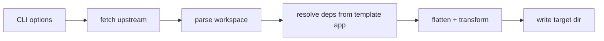

# v1.0.0 开发指南 — create-vben CLI

> **文档性质：** 当前里程碑 **强制开发与验收规范**。  
> **里程碑：** **v1.0.0** — 首个可从 upstream 生成单模板脚手架的 CLI。  
> **共享规范：** [`.cursor/rules/create-vben-core.mdc`](../../../.cursor/rules/create-vben-core.mdc)。  
> **Agent：** [`AGENTS.md`](../../../AGENTS.md)

| 字段         | 值                                                                |
| ------------ | ----------------------------------------------------------------- |
| 版本         | 1.0                                                               |
| **工作分支** | **`v1.0.0`**                                                      |
| **集成分支** | **`dev`**                                                         |
| 产品 PRD     | [`product/PRD_create-vben.md`](product/PRD_create-vben.md)        |
| upstream     | [vbenjs/vue-vben-admin](https://github.com/vbenjs/vue-vben-admin) |
| Agent        | [`AGENTS.md`](../../../AGENTS.md)                                 |

---

## 0. 开发流程

遵循 Core 规范：**询问 → 设计/规划 → 分步开发 → 验证/修复 → 下一步**。

| 协作约束     | 说明                                                                                                                                                    |
| ------------ | ------------------------------------------------------------------------------------------------------------------------------------------------------- |
| **提交**     | Agent **不得**自行 commit；负责人验证后再提交                                                                                                           |
| **粒度**     | 每个 **CV1-\* 步骤** 独立 commit                                                                                                                        |
| **核心优先** | extract / resolve **先于** CLI 美化                                                                                                                     |
| **upstream** | 结构以官方 repo + [目录文档](https://doc.vben.pro/guide/project/dir.html) 为准；变更须更新 [`vben-source-sync.md`](../../decisions/vben-source-sync.md) |
| **文档**     | 只记录**稳定决策与步骤状态**；不写易变指标（测试数等）                                                                                                  |

每步完成：更新 **§4 进度表** → `pnpm verify` → **review** → commit。

---

## 1. 项目目标（摘要）

### 1.1 问题

vue-vben-admin 以 Monorepo 维护多套 UI 模板（`apps/web-antd` 等）与大量 `packages/`。用户若只要 **一种 UI 库**，仍需 clone 整个仓库，认知与磁盘成本高。

### 1.2 方案

**create-vben** CLI：

1. 从 GitHub 获取指定 **ref** 的 upstream 快照
2. 解析 **pnpm workspace** 依赖图
3. 以所选 `apps/web-*` 为根，收集 **transitive workspace 依赖**
4. 重写 `package.json`（`workspace:*` → 相对路径或合并策略）
5. 写入用户目录，可选 `git init` + 安装指引

### 1.3 使用方式（验收标准）

```bash
npx create-vben my-app
# 或
npx create-vben my-app --template web-antd --ref v5.7.0
cd my-app && pnpm install && pnpm dev
```

### 1.4 不在本里程碑

- 修改 upstream 源码或 fork 长期维护
- 生成物与官方 Monorepo **行为完全一致**（允许 sensible 简化，须文档说明）
- 多模板同时生成
- `backend-mock` 默认打包（可选 flag，CV1-11 再议）

---

## 2. 目标架构

```text
src/
├── index.ts                 # bin 入口
├── cli/                     # commander + prompts
├── core/constants.ts        # 模板 ID、upstream 元信息
├── extract/
│   ├── fetch-upstream.ts    # tarball / 缓存
│   ├── parse-workspace.ts   # pnpm-workspace.yaml
│   ├── resolve-deps.ts      # workspace 依赖图
│   └── flatten.ts           # 扁平输出路径规划
├── generate/
│   ├── create-project.ts    # 编排
│   ├── write-files.ts       # 磁盘写入
│   └── transform-package-json.ts
└── utils/
```

**数据流：**



---

## 3. 分步计划（CV1-\*）

| 步骤        | 主题                  | 交付物                                                              | 验收                                        |
| ----------- | --------------------- | ------------------------------------------------------------------- | ------------------------------------------- |
| **CV1-01**  | 仓库脚手架            | package.json · tsconfig · tsup · vitest · AGENTS · rules · 占位 CLI | `pnpm verify` 通过；`pnpm dev` 可进入交互   |
| **CV1-02**  | upstream 同步策略 ADR | `vben-source-sync.md` 定稿                                          | 缓存目录、ref 策略、网络失败行为已文档化    |
| **CV1-03**  | 拉取 upstream         | `fetch-upstream.ts` + 测试（mock fetch）                            | 指定 ref 解压到 cache；`--offline` 读 cache |
| **CV1-04**  | 解析 workspace        | `parse-workspace.ts` + fixture                                      | 从 fixture 读出 apps/packages 列表          |
| **CV1-05**  | 依赖图 + 输出形态 ADR | `architecture.md` 更新 · `resolve-deps.ts`                          | 给定 template，返回须拷贝的包集合           |
| **CV1-06**  | 扁平化与 transform    | `flatten.ts` · `transform-package-json.ts`                          | workspace 协议正确改写；有快照测试          |
| **CV1-07**  | 生成编排              | `create-project.ts` · `write-files.ts`                              | 非 dry-run 写出可 install 的项目            |
| **CV1-07b** | vendor 预构建门禁     | `vendor-stub.ts` · install/stub 失败即失败                          | 生成后 `internal/vite-config/dist` 存在     |
| **CV1-08**  | CLI 完善              | 错误处理 · `--force` · 日志                                         | 边界用例有测试或文档                        |
| **CV1-09**  | 集成测试              | `test/integration/*.test.ts` + 精简 fixture                         | 至少 1 个 template 端到端                   |
| **CV1-10**  | 生成物文档            | 模板 README 片段                                                    | 用户知悉 upstream ref 与差异                |
| **CV1-11**  | 可选能力              | `--mock` / `--git` 等待定                                           | 按 PRD Q\* 确认后做                         |
| **CV1-12**  | 发布准备              | changesets 或 manual version · CI                                   | `npm pack` 可安装；是否发 npm 待负责人确认  |

---

## 4. 进度表

| 步骤    | 状态 | 备注                                      |
| ------- | ---- | ----------------------------------------- |
| CV1-01  | ✅   | 2026-06-09 脚手架与规范文档               |
| CV1-02  | ✅   | 2026-06-09 Q2/Q6 定稿 vben-source-sync    |
| CV1-03  | ✅   | 2026-06-09 fetch-upstream + 缓存          |
| CV1-04  | ✅   | 2026-06-09 parse-workspace + fixture      |
| CV1-05  | ✅   | 2026-06-09 Q1 扁平输出 + resolve-deps     |
| CV1-06  | ✅   | 2026-06-09 flatten + transform            |
| CV1-07  | ✅   | 2026-06-09 create-project + pnpm install  |
| CV1-07b | ✅   | 2026-06-09 vendor stub 门禁 + dist 校验   |
| CV1-08  | ⬜   | 根 devDeps 推导 + --force 测试补强        |
| CV1-09  | ⬜   | 端到端集成测试（真实 ref）                |
| CV1-10  | ✅   | 2026-06-09 生成 README 片段               |
| CV1-11  | ⬜   | 不含 backend-mock（Q3 已确认，无需 flag） |
| CV1-12  | ⬜   | npm 包名 create-vben 已确认；发布 CI 待定 |

---

## 5. 待确认项（Agent 勿臆造）

| #   | 项                                                              | 影响步骤 | 状态 |
| --- | --------------------------------------------------------------- | -------- | ---- |
| Q1  | 生成物结构：**单 package 扁平**                                 | CV1-05   | ✅   |
| Q2  | 默认 upstream ref：**最新 release tag**                         | CV1-02   | ✅   |
| Q3  | 是否默认包含 `backend-mock`：**否**                             | CV1-11   | ✅   |
| Q4  | npm 发布：**create-vben**（无 scope）                           | CV1-12   | ✅   |
| Q5  | 生成后 **自动 pnpm install**                                    | CV1-07   | ✅   |
| Q6  | GitHub token：**v1.0.0 默认不用**；后续支持用户配置（长期计划） | CV1-03   | ✅   |

---

## 6. 验证命令

```bash
pnpm install
pnpm verify
pnpm dev -- --dry-run my-vben-admin --template web-antd
# 手动/测试生成物写入 .temp/generated/（已 gitignore）
pnpm dev -- .temp/generated/e2e-app --template web-naive --ref v5.7.0 --force
```

---

## 7. 下一步（§7.8 等价）

**→ CV1-08：** 根 devDependencies 系统化推导 + CLI 边界测试。

新开 Agent 时复制：

```
项目：/Users/wb_hc/H-Zone/DEV/create-vben
读：AGENTS.md → create-vben-core.mdc → 本文 CV1-08
已决：P0 vendor stub 门禁 · Q1 扁平 · Q2 latest tag
```

---

_进度变更时更新 §4；决策变更时同步 `docs/decisions/` 与 README。_
